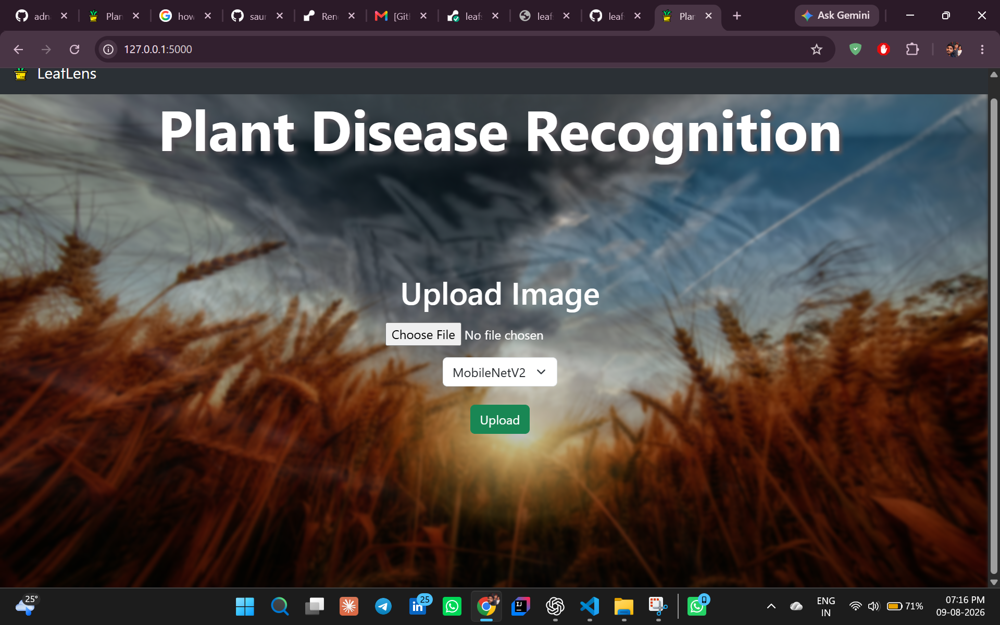
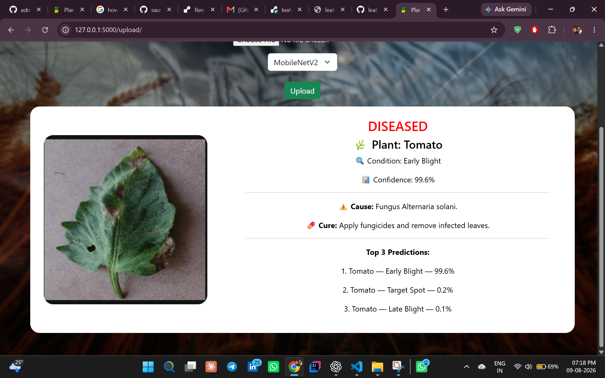
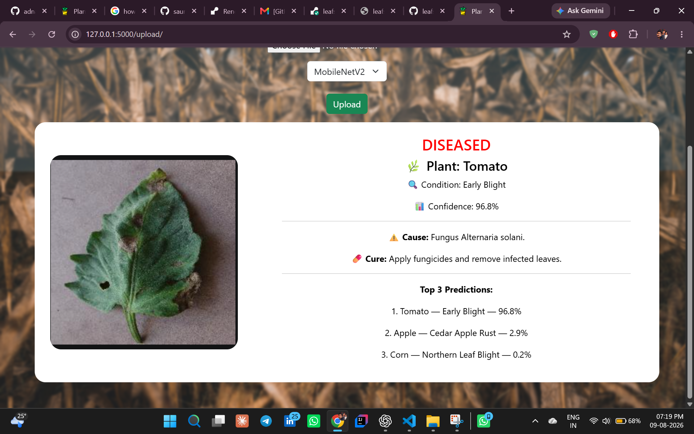

# LeafSense AI 🌿

An AI-powered plant disease detection system that analyzes plant leaf
images using deep learning models and provides disease information,
confidence scores, and recommended treatments.

The system provides two trained models for comparison:

- Custom CNN
- MobileNetV2 using Transfer Learning

The models are integrated into a Flask-based web application that allows
users to upload a leaf image and receive a prediction through an
interactive interface.

---

## ✨ Features

- 🌱 Plant disease detection from leaf images
- 🧠 Custom CNN classification model
- 📱 MobileNetV2 transfer-learning model
- 🔄 Model selection through the web interface
- 📊 Top-3 predictions with confidence scores
- 🩺 Disease cause information
- 💊 Recommended treatment information
- 🖼️ Image upload and preprocessing
- 🚫 Detection of unrecognized/non-leaf images
- 🌐 Flask-based web interface

---

## 🛠️ Tech Stack

### Machine Learning

- Python
- TensorFlow
- Keras
- NumPy
- Convolutional Neural Networks (CNN)
- MobileNetV2
- Transfer Learning

### Web Application

- Flask
- HTML
- CSS
- JavaScript
- Bootstrap

### Tools

- Git
- GitHub
- VS Code

---

## 🧠 Machine Learning Models

### Custom CNN

A custom Convolutional Neural Network developed and trained for plant
disease classification.

### MobileNetV2

A MobileNetV2-based transfer-learning model used for plant disease
classification.

Both models are integrated into the application and can be selected
directly from the web interface.

---

## 🔬 System Workflow

```text
                    Leaf Image
                        │
                        ▼
                  Image Upload
                        │
                        ▼
                Image Preprocessing
                  160 × 160 pixels
                        │
                        ▼
                 Model Selection
                  /            \
                 /              \
                ▼                ▼
          Custom CNN        MobileNetV2
                \                /
                 \              /
                  ▼            ▼
              Classification
                        │
                        ▼
                Top-3 Predictions
                        │
                        ▼
                Confidence Scores
                        │
                        ▼
             Disease Information
                        │
                        ▼
                  Treatment
```

---

## 📊 Prediction Output

For a given leaf image, the application provides:

- Predicted plant and disease/condition
- Confidence score
- Top-3 predictions
- Disease cause
- Recommended treatment

---

## 📁 Project Structure

```text
leafsense-ai/
│
├── app.py
├── models/
│   ├── class_names.txt
│   ├── plant_health_cnn_model.keras
│   └── plant_health_mobilenetv2_model.keras
│
├── static/
├── templates/
├── uploadimages/
├── plant_disease.json
├── requirements.txt
├── .gitignore
├── README.md
└── LICENSE
```

---

## 🚀 Getting Started

### Prerequisites

Make sure you have the following installed:

- Python 3.11
- Git
- pip

### 1. Clone the Repository

```bash
git clone https://github.com/saurav80325-create/leafsense-ai.git
cd leafsense-ai
```

### 2. Create a Virtual Environment

#### Windows

```bash
python -m venv venv
```

Activate the environment:

```bash
venv\Scripts\activate
```

### 3. Install Dependencies

```bash
pip install -r requirements.txt
```

### 4. Run the Application

```bash
python app.py
```

### 5. Open the Application

Open the following URL in your browser:

```text
http://127.0.0.1:5000
```

---

## 🖥️ Application

The application provides a simple web interface where users can:

1. Upload a plant leaf image.
2. Select either the Custom CNN or MobileNetV2 model.
3. Submit the image for analysis.
4. View the predicted plant disease.
5. View the confidence score and top-3 predictions.
6. View the possible cause and recommended treatment.

### Home Interface



### Custom CNN Prediction



### MobileNetV2 Prediction


---

## 👥 Contributors

This project was developed collaboratively as a college minor project.

- Saurav Yadav
- Adnan

Both contributors contributed to the development of the project, including
machine learning model development, training, evaluation, image
preprocessing, and Flask web application integration.

---

## 📌 Project Status

**Completed — College Minor Project**

The project is available for local execution with both trained models
integrated into the Flask web application.

---

## 📄 License

This project is licensed under the MIT License.